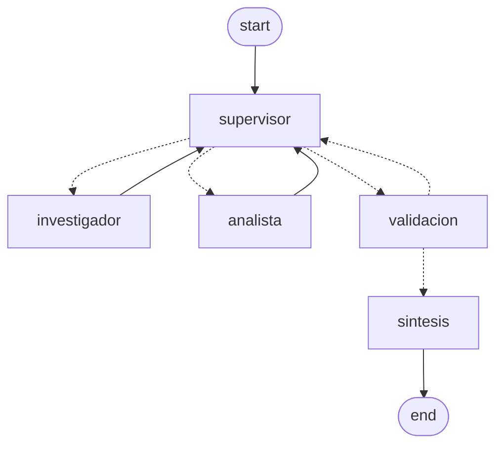

# Pre-entrega 6: Orquestador multi-agente especializado

Este es el repo de mi pre-entrega 6 del curso de AI Engineering. Armé un equipo de agentes que
resuelve un pedido que necesita **dos dominios distintos** y una síntesis final: un Supervisor
que decide quién trabaja, un investigador que busca datos en las políticas internas de la empresa
y un analista que hace las cuentas con una calculadora segura. Cuando los aportes alcanzan, un
nodo de validación cierra el flujo y se redacta la respuesta.

`python main.py` corre dos consultas y muestra el flujo paso a paso. Lo que sigue son salidas
reales de una corrida contra Gemini y Pinecone (recorté algunas líneas para que se lea; las
trazas completas están en los `.json` que dejé en el repo).

## Consulta 1: la que necesita los dos dominios

> Un colaborador cumplió 12 años en la empresa: 2 años con menos de 3 de antigüedad, 6 años
> con entre 3 y 8, y 4 años con más de 8. ¿Cuántos días de vacaciones le correspondieron en
> total a lo largo de esos 12 años?

```
🔹 supervisor    decide -> investigador | instrucción: Buscá en la política interna de vacaciones...
🔹 investigador  [investigador] Según la política de vacaciones: menos de 3 años: 15 días...
🔹 supervisor    decide -> analista | instrucción: Calculá el total multiplicando 2 años por 15...
🔹 analista      [analista] Resultado: 250
🔹 supervisor    decide -> FINISH
🔹 validacion    suficiente=True | Los dominios exigidos (investigador, analista) aportaron...
🔹 sintesis      [supervisor] A lo largo de los 12 años le correspondieron 250 días hábiles.
```

Fijate en el orden. El analista no puede correr antes que el investigador porque los números que
multiplica son los que el investigador trajo de la política: la segunda delegación depende de la
primera, no salen las dos en paralelo.

## Consulta 2: la que se responde con un solo dominio

> ¿Se puede tomar vacaciones en enero y qué pasa con los días que quedan sin usar al cerrar el
> año?

```
🔹 supervisor    decide -> investigador | instrucción: Buscá en la política interna de vacaciones si está permitido tomarlas en enero...
🔹 investigador  [investigador] Vacaciones en enero: régimen especial de guardias mínimas, cupo del 25%...
🔹 supervisor    decide -> FINISH
🔹 validacion    suficiente=True | Los dominios exigidos (investigador) aportaron...
🔹 sintesis      [supervisor] Enero: sí, con cupo del 25% y solicitud antes del 30/11; los días sin usar: máximo 5...
```

Acá el supervisor **no llama al analista** porque no hay cuenta que hacer, y cierra apenas tiene
el dato: 5 pasos contra 7 de la consulta anterior. Eso solo funciona porque la rúbrica se adapta a
la pregunta. Si exigiera el análisis siempre, esta consulta no terminaría nunca.

El camino de **re-delegación**, o sea volver a mandar al mismo especialista con otra instrucción
cuando la primera respuesta no alcanza, está implementado y lo cubren los tests de
`test_supervisor.py` y `test_integracion.py`. En esta corrida no se ve porque el investigador
contestó las dos partes de una, pero el test del supervisor que se empecina con un agente que ya
aportó lo ejercita todos los días.

Las trazas completas quedan en [`traza_ejecucion.json`](traza_ejecucion.json) y
[`traza_consulta_simple.json`](traza_consulta_simple.json), y el notebook
[`demo_flujo.ipynb`](demo_flujo.ipynb) está publicado ya ejecutado, con las salidas de la corrida
real.

## Topología elegida: jerárquica (patrón Supervisor)



Elegí la jerárquica y no la colaborativa por una razón concreta. En la colaborativa los agentes
se hablan entre sí y el orden lo negocian ellos: es más flexible, pero el resultado depende de
que dos modelos se pongan de acuerdo, y cuando los dos creen tener razón se repiten entre ellos.
Acá el orden lo fija un solo nodo. El supervisor es el único que ve las contribuciones acumuladas
y el único que decide si falta algo, quién lo hace y cuándo se cierra. Los especialistas no se
conocen entre sí: no hay ninguna arista de investigador a analista.

Cómo se manejan los conflictos entre agentes (cinco casos, ninguno por "voluntad" del modelo):

| Caso | Qué pasa | Cómo se resuelve |
|---|---|---|
| El especialista devuelve un error (`ERROR:` / "No se encontró") | El aporte no sirve para cerrar | El validador lo cuenta como dominio sin cubrir y el supervisor lo vuelve a mandar con otra instrucción |
| El supervisor insiste con un agente que ya aportó | El otro dominio nunca se cubre | `_corregir_decision()` (en `supervisor.py`) redirige al dominio que falta, con una instrucción del oficio correcto |
| El supervisor quiere cerrar antes de tiempo | Saldría una respuesta a medias | El validador determinista manda: no se cierra con un dominio exigido sin cubrir |
| Los dos quieren hablar para siempre | Bucle eterno (el "Supervisor Infinito" del enunciado) | Tres redes: `MAX_PASOS` en el supervisor, `MAX_REINTENTOS` en las aristas y el validador, que es código y no LLM |
| El proveedor rechaza una llamada (cuota, red) | El especialista se cae y el grafo queda a medias | El nodo envuelve la llamada: el aporte vuelve como `ERROR: <motivo>` y el equipo decide qué hacer |

## Estructura del repo

```
state.py                    # AgentState: el estado compartido (esquema del grafo)
tools.py                    # las herramientas: búsqueda en las políticas + calculadora SEGURA (ast, no eval)
agents/
  research_agent.py         # especialista en investigación (búsqueda acotada)
  analyst_agent.py          # especialista en análisis/cómputo (calculadora acotada)
supervisor.py               # el router: salida estructurada, la rúbrica y el corte por pasos
validation.py               # el nodo de Validation: ¿ya se puede cerrar?
nodes.py                    # los nodos que envuelven a los especialistas + la síntesis
graph.py                    # el armado del grafo (aristas condicionales, el ciclo y las rutas de corte)
llm_factory.py              # el modelo por variable de entorno + el traductor de errores de los SDK
rag.py                      # el recuperador híbrido (BM25 + Pinecone con embeddings locales)
ingest.py                   # puebla el índice de Pinecone desde data/ (el índice sigue al dataset)
main.py                     # la demo de punta a punta (las dos consultas) + las trazas
construir_notebook.py       # genera y ejecuta demo_flujo.ipynb (salidas reales)
demo_flujo.ipynb            # el notebook ejecutado que demuestra el flujo
traza_ejecucion.json        # la traza real de la consulta de dos dominios
traza_consulta_simple.json  # la traza real de la consulta de un dominio
tests/                      # 68 pruebas que corren SIN claves y SIN red
data/                       # dataset de ejemplo (empresa ficticia, ver nota al final)
```

## El estado compartido

`AgentState` hereda de `MessagesState` y le agrego estos campos:

| Campo | Para qué |
|---|---|
| `next_agent` | A quién decidió llamar el supervisor (`investigador`, `analista` o `FINISH`) |
| `instruccion` | La instrucción puntual que le deja al especialista elegido |
| `contribuciones` | `Annotated[List[...], operator.add]`, declarado explícito y no heredado: cada aporte se suma a la lista con su autor. Es lo que evita la pérdida de contexto en la comunicación asíncrona, porque sin el reducer el aporte del último pisaría al anterior |
| `pasos` | Cuántos especialistas corrieron (es el contador del corte) |
| `task_completed` | Si el flujo ya cerró |
| `validacion` | El informe del validador: `suficiente`, `faltantes`, `dominios_exigidos`, `motivo` |
| `reintentos` | Cuántas veces el validador mandó a refinar |

## Contexto acotado (cómo se evita la contaminación de contexto)

A cada especialista le llega un solo mensaje con tres bloques:

```
Pregunta original: <la consulta del usuario>

Instrucción del supervisor: <qué tiene que hacer exactamente>

Contexto disponible (aportes del equipo hasta ahora):
- [investigador] <los números que trajo>
```

No le llega el historial completo, ni las decisiones previas, ni la metadata del sistema. Lo que
sí le llega es la pregunta original. Me di cuenta de que hacía falta a la fuerza: sin eso el
analista no sabe cuántos años tiene el colaborador y contesta que le falta un número. Hay un test
que lo cubre.

## La rúbrica del validador (lo que se exige para cerrar)

El validador es código, no LLM, y exige que cada aporte sea verificable:

| Dominio | Criterio verificable |
|---|---|
| investigador | El aporte trae el dato con su fuente (`[Fuente: ...]`) |
| analista | El aporte trae el output de la calculadora (`Resultado: ...`) |

Un aporte con marca de error (`ERROR:`, `Error al calcular`, `No se encontró`) no cubre su
dominio aunque tenga texto de sobra.

Y la rúbrica se adapta a la pregunta: el investigador siempre es obligatorio, porque todo dato de
la empresa sale de las políticas, y el analista solo si la pregunta pide una cuenta (un número,
un total, un prorrateo). Además, si la rúbrica ya se cumple el guardia cierra: no deja seguir
delegando por las dudas. Eso también salió de una corrida real, donde el supervisor pidió tres
rondas de investigación de más sobre una pregunta ya respondida.

## El dataset y el índice

Los documentos de `data/` son las políticas internas de una empresa ficticia. Los escribí con la
extensión necesaria para que el chunking haga su trabajo (fragmentos de 600 tokens con 100 de
solape):

| Documento | Tokens |
|---|---|
| `politica_vacaciones.txt` | ~1.630 |
| `politica_teletrabajo.txt` | ~1.355 |
| `politica_seguridad_informatica.txt` | ~1.090 |
| `onboarding_nuevos_empleados.txt` | ~970 |

Son unos 5.050 tokens en total, que quedan en 15 fragmentos. Un test en `tests/test_rag.py`
verifica que ningún documento quede por debajo del tamaño de fragmento: si alguien agrega un
`.txt` corto, falla.

`ingest.py` es la única forma de poblar el índice de Pinecone y lo hace desde `data/`:

```bash
python ingest.py              # limpia el namespace y sube los fragmentos actuales
python ingest.py --verificar  # informa qué hay hoy en el índice, sin escribir nada
```

Los ids de los fragmentos son deterministas (`<archivo>::<n>`), así correrlo dos veces no duplica
vectores, y si falta la clave el script corta con un mensaje claro en vez de seguir. Actualizar el
índice a medias es peor que no actualizarlo.

## Cómo correrlo

```bash
python -m venv .venv && source .venv/bin/activate
pip install -r requirements.txt

cp .env.example .env      # y completá las claves (Gemini gratis en aistudio.google.com/apikey)

python main.py               # las dos consultas de la demo: flujo + respuesta + trazas
python main.py "otra pregunta"
python main.py --topologia   # imprime el diagrama Mermaid del grafo
python ingest.py             # puebla el índice de Pinecone desde data/
python -m pytest -q          # las 68 pruebas (corren sin claves y sin red)
```

Variables de entorno (todas documentadas en `.env.example`):

| Variable | Para qué | Obligatoria |
|---|---|---|
| `LLM_PROVIDER` | `gemini` (default), `openai` o `anthropic` | no |
| `GOOGLE_API_KEY` | clave de Gemini (free tier) | sí, para la corrida real |
| `PINECONE_API_KEY` | base vectorial de la pre-entrega anterior | no: sin ella el recuperador queda en modo léxico y lo avisa |
| `INDEX_NAME` / `PINECONE_NAMESPACE` | nombre del índice y del namespace | no |
| `GEMINI_MODEL` / `OPENAI_MODEL` / `ANTHROPIC_MODEL` | modelo por proveedor | no |

Si falta la clave del proveedor, `get_llm()` corta con un `ValueError` que dice qué variable
falta, en vez de fallar más tarde con un error opaco del SDK.

## Las pruebas (68, sin claves)

Son 68 y **no llaman al modelo ni a Pinecone**: inyectan dobles en los tres lugares donde habría red
(supervisor, especialistas y LLM de la síntesis). El `conftest` además limpia la clave de Pinecone
del entorno, así ninguna prueba puede terminar pegándole a la nube por accidente.

| Archivo | Qué cubre |
|---|---|
| `test_state.py` | El reducer de `contribuciones` y los campos extra del estado |
| `test_tools.py` | La calculadora resuelve bien y no ejecuta código: los intentos con `__import__`, `open` o `__subclasses__` no crean ningún archivo, y el test lo comprueba en disco |
| `test_supervisor.py` | Salida estructurada, corte por `MAX_PASOS`, corrección de delegación repetida y de cierre prematuro, y que una delegación sin instrucción no sea válida |
| `test_validation.py` | Suficiencia, errores, los dos casos que aparecieron en las corridas reales y la rúbrica que se adapta |
| `test_nodes.py` | Contexto acotado (un mensaje, con la pregunta + instrucción + aportes), la síntesis, y que un especialista que falla devuelva `ERROR:` sin tumbar el grafo |
| `test_graph.py` | Los mapeos de las aristas condicionales y las tres rutas de corte |
| `test_integracion.py` | El flujo completo investigador -> analista -> validación -> síntesis, y el corte con un supervisor que se empecina |
| `test_rag.py` | Que cada documento del dataset supere el tamaño de fragmento y que el modo del recuperador (híbrido/léxico) se pueda informar |
| `test_ingest.py` | Ids deterministas (no duplican vectores) y corte con mensaje claro si falta la clave |
| `test_llm_factory.py` | Validación estricta de variables de entorno y traducción de los errores de cada SDK |

## La traza, paso a paso

Así se lee `traza_ejecucion.json` (los pasos de la consulta de dos dominios):

| # | Nodo | Qué hizo |
|---|---|---|
| 1 | supervisor | decide -> investigador, y le pide el dato de los tramos con su fuente |
| 2 | investigador | devuelve el dato con `[Fuente: politica_vacaciones.txt]` |
| 3 | supervisor | decide -> analista, y le pide la cuenta con los números que ya están |
| 4 | analista | devuelve `Resultado: 250` desde la calculadora |
| 5 | supervisor | decide -> FINISH |
| 6 | validacion | `suficiente=True`: los dominios exigidos aportaron |
| 7 | sintesis | redacta la respuesta final para el usuario |

## Errores y resiliencia

- Los errores del proveedor salen con mensaje útil: `mensaje_de_error()` traduce las excepciones
  de los SDK mirando el nombre de la clase (cuota, clave, red) a una frase accionable, en vez de
  un `try/except` genérico con un volcado de stacktrace.
- Un especialista que se cae no tumba el grafo. La llamada al modelo va envuelta y el aporte
  vuelve como `ERROR: <motivo>`; el validador lo cuenta como dominio sin cubrir y el supervisor
  decide qué hacer.
- Nada de degradar en silencio: si no hay Pinecone, el log lo dice con `WARNING` y la demo imprime
  el modo real del recuperador (`híbrido` o `léxico`), leído del objeto que quedó armado y no de
  lo que pide el `.env`.
- Validación estricta: el `DecisionSupervisor` es un Pydantic con `Field(min_length=...)` y un
  validador que rechaza delegar sin instrucción.

## Lo que encontré corriendo la demo de verdad

Los dobles no muestran todo. Correr la demo contra el modelo real destapó seis cosas, y cada una
tiene su test de regresión para que no vuelvan:

1. El especialista recibía su propia respuesta anterior como instrucción. Por eso el investigador
   contestaba "quedame a disposición" y el analista no llegaba a correr nunca. Lo arreglé pasando
   la instrucción del supervisor (el campo `instruccion`) en vez del último mensaje.
2. El supervisor le mandaba al analista una orden de búsqueda, o sea una instrucción del otro
   oficio. El analista se negaba y ese texto igual cerraba el flujo. Lo arreglé en los dos lados:
   el prompt del supervisor pide instrucciones por oficio y el validador exige la marca de la
   calculadora.
3. El analista no veía la pregunta original, así que pedía el dato. Ahora el contexto acotado la
   incluye: acotado quiere decir sin el historial, no sin el pedido.
4. La demo corría el grafo dos veces (una para imprimir el flujo y otra para la respuesta) y las
   dos corridas podían no coincidir. Lo pasé a una sola corrida: el flujo se lee del stream de
   `updates` y el estado final del de `values`.
5. La rúbrica exigía el análisis siempre, así que una pregunta sin cuentas no podía cerrar. Ahora
   el validador decide qué dominios exigir según la pregunta.
6. El supervisor seguía delegando después de tener todo lo necesario: en una corrida pidió tres
   rondas de investigación de más sobre una pregunta ya respondida. Ahora, si la rúbrica está
   cumplida, el guardia cierra.

## Lo que ajusté mirando las devoluciones anteriores

Antes de armar esto volví a leer las devoluciones de las pre-entregas 1 a 5 y anoté lo que me
venían marcando, para no arrastrar lo mismo de entrega en entrega. Es lo que hice en este repo:

- Los documentos de `data/` eran demasiado cortos para el umbral de tokens: reescribí las cuatro
  políticas completas (unos 5.050 tokens en 15 fragmentos) y dejé un test que lo vigila.
- Me marcaron que degradar en silencio puede enmascarar errores de configuración: ahora el
  recuperador avisa por `WARNING` cuando no tiene Pinecone, la demo imprime el modo real y
  `ingest.py` corta en vez de seguir.
- También me marcaron una incoherencia entre el índice y el dataset: dejé `ingest.py` como única
  vía de carga, con ids deterministas, y el índice se verifica contra los fragmentos de `data/`.
- El multi-paso de la entrega anterior quedó "plano", con las invocaciones en el mismo turno: acá
  la consulta principal obliga a que el analista use lo que trajo el investigador, y hay una
  segunda consulta que se cierra con un solo dominio.
- Pedían excepciones específicas por SDK y validación estricta de esquemas: están
  `mensaje_de_error()`, el aporte en `ERROR:` que no tumba el grafo y el `DecisionSupervisor` con
  `Field` y validador propio.
- Y pedían documentar la traza paso a paso: está la sección de arriba y el notebook, que la
  imprime numerada.

## Notas

- El dataset es de una empresa ficticia y el texto está inventado. El nombre del dominio es el de
  una agencia real, como contexto del ejercicio; los datos no son reales. Es el mismo dataset de
  las pre-entregas 3 y 4 porque el curso pide que cada módulo se apoye en el anterior.
- Corre gratis: embeddings locales (`sentence-transformers/all-MiniLM-L6-v2`, 384 dimensiones,
  sin API key) más el free tier de Gemini. El recuperador es híbrido (BM25 + vectorial), y si no
  hay Pinecone configurado sigue andando en modo léxico, avisando.
- El notebook se regenera con `python construir_notebook.py`, que lo ejecuta y guarda las salidas
  reales.
